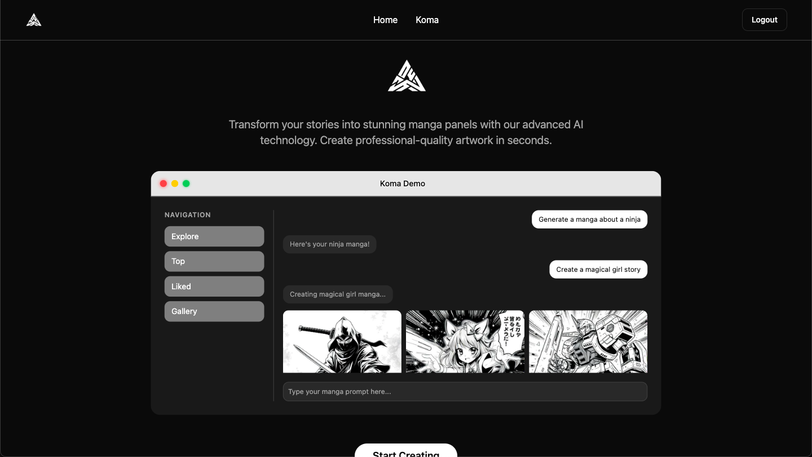
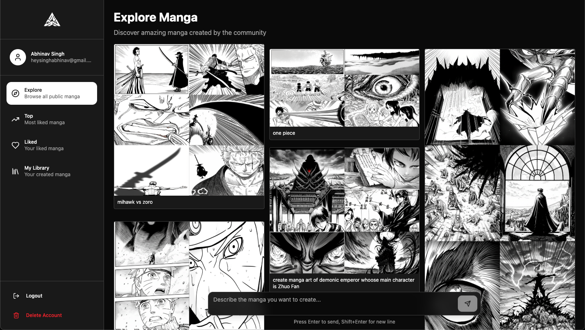

# **Koma-AI**  
A **modern, minimalist UI** for **AI-powered manga generation**, built with **React + TypeScript**, **Framer Motion**, and **ShadCN/UI**. It allows users to create manga panels using **Google Gemini API** with their own API key (securely stored with Crypto).

**Live Site:** [https://www.koma-ai.app](https://www.koma-ai.app)

---

## **Features**  
- AI Manga Generation using **Google Gemini**  
- Secure **API Key Encryption** (via Crypto)  
- Sleek UI with **ShadCN components**  
- Smooth **Framer Motion animations**  
- Responsive & Minimal Design  
- **Hosted on Vercel** for blazing-fast performance  

---

## **Quick Start (No Setup Required)**  
 Just visit: **[koma-ai.app](https://www.koma-ai.app)**  
1. Signup.  
2. Type a prompt like:  
   *"Generate a manga about a ninja"*  
3. Enjoy your AI-generated manga panels instantly!  

---

## **Tech Stack**  
- **React + TypeScript**  
- **ShadCN/UI** (for components)  
- **Framer Motion** (animations)  
- **Vercel** (deployment)  
- **Crypto API** (secure key handling)  

---

## **Local Development (For Contributors)**  

```bash
# Clone repo
git clone https://github.com/SinghAbhinav04/koma.git
cd koma

# Install dependencies
npm install

# Run development server
npm run dev
```

---

## Security
- **API keys are encrypted before storage**

---

### Future Plans
- Multi-panel manga generation
- Save & share galleries
- More manga art styles

---

### Live Preview Screenshot:



---

## **License**
[](./LICENSE)

